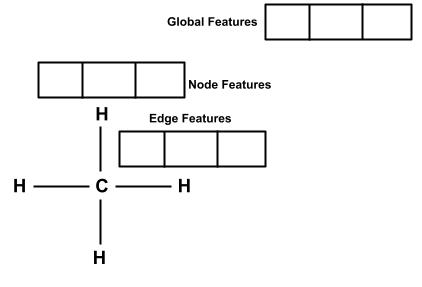
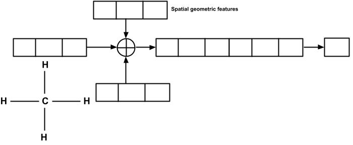

# Molecule Graphs for Scalar Coupling Constant Prediction

## Introduction
The scalar coupling constant (J) in organic chemistry measures nuclear spin interactions, causing nuclear magnetic resonance spectroscopy (NMR) peak splitting. It's used to determine molecular connectivity and spatial arrangement, aiding in structural elucidation and compound identification. This project focuses on using the molecule, atom, bond and spatial geometric features to predict the scalar coupling coanstant between two atoms of a molecule. To this end a modified MEGNet is used.

## Features

- **Graph Representation**: Decompose molecules into edges(bond), nodes (atoms), and global features for a comprehensive graph-based analysis.
- **Scalar Coupling Prediction**: Utilize machine learning models that incorporate geometric features to predict scalar coupling constants.
- **Feature Engineering**: Concatenate various geometric factors, such as distances between atoms, distances from the molecule's center, distances from nearest neighbors, and angles between relevant atoms.

## Features used for Graph Representation

- **NODE**: The atoms of a molecule are represented as the node incorporating information such as the atomic number of the atom and the XYZ co-ordinate of the atom
- **EDGE**: The bonds of a molecule are represented as the edge incorporating information such as the type of bond and the distance between 2 atoms of the bond
- **Global**: A blank tensor is used for global representation of a molecule to facilitate information propagation between faraway atoms

- 
## Model Prediction

